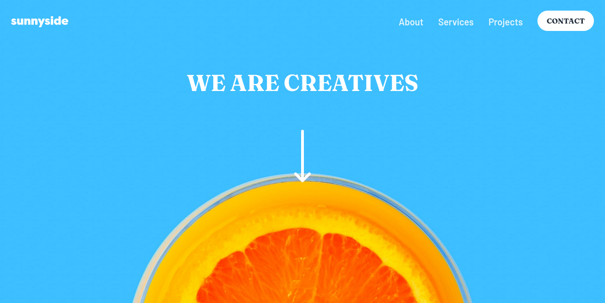
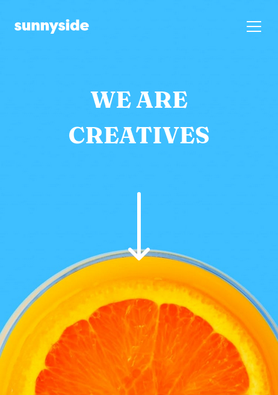

# Sunnyside Landing Page from Frontend Mentor

This is a solution to the **Sunnyside Landing Page** challenge from [Frontend Mentor](https://frontendmentor.io)

## Table Of Contents

- [Sunnyside Landing Page from Frontend Mentor](#sunnyside-landing-page-from-frontend-mentor)
  - [Table Of Contents](#table-of-contents)
  - [Preview](#preview)
    - [Desktop](#desktop)
    - [Mobile](#mobile)
  - [Techniques, Tools and Languages](#techniques-tools-and-languages)
    - [Techniques](#techniques)
    - [Tools](#tools)
    - [Devices and OS](#devices-and-os)
  - [Languages](#languages)
  - [Process](#process)
    - [Create Vite Application](#create-vite-application)
  - [Links](#links)

## Preview

### Desktop

Preview of the website on Desktop



### Mobile

Preview of the website on Mobile



## Techniques, Tools and Languages

### Techniques

- CSS `grid`
- CSS `flex`
- CSS `@media` queries
- Semantic HTML
- JavaScript Event Listeners

### Tools

- Visual Studio Code
- Mozilla Firefox
- Brave
- Vite

### Devices and OS

- Ubuntu 22.04 LTS
- Samsung Galaxy A13 (Android 14)

## Languages

- HTML5
- CSS3
- Javascript ES6

## Process

The process and workflow behind the project

### Create Vite Application

This project is built using **[Vite](https://vitejs.dev)**.
Using this command, create a vite app.

```
npm create vite@latest -- --template vanilla folderName
```

then change the active directory to the vite folder, and install all the dependencies.

```
cd folderName
```

Install dependencies and packages

```
npm install
```

Run the development server

```
npm run dev
```

## Links

Follow the links below to view the source and live preview.

- [GitHub Repository](https://github.com/Code-Beaker/sunnyside-landing-page-code-beaker-production)
- [Vercel Deploy](https://sunnyside-landing-page-code-beaker-production.vercel.app/)
